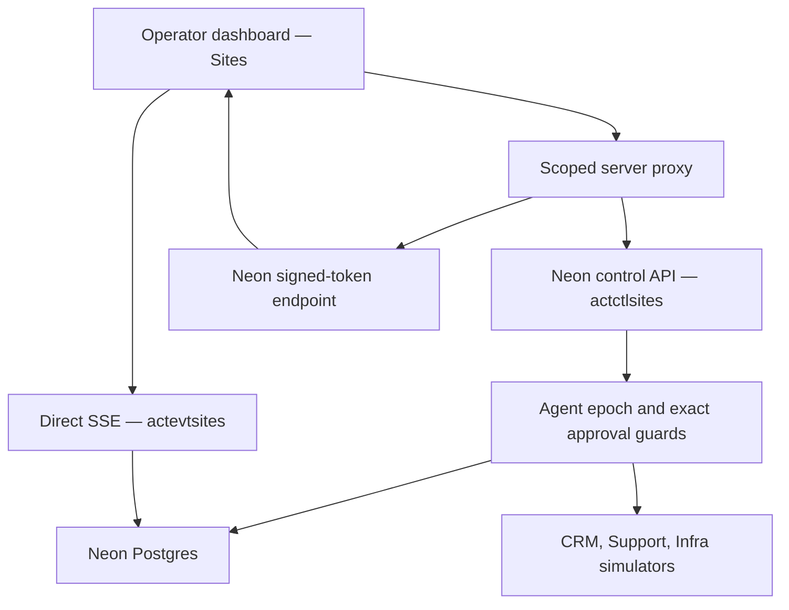

# Architecture snapshot

Sites compiles the App Router through Vinext into a Cloudflare Worker. It uses HTTP to Neon; no direct PostgreSQL TCP connection runs in Sites. The control plane owns registry, execution, policy/risk gates, approvals, drift, usage and audit. Durable state and append-only evidence live in Neon.

The Site signs upstream requests for 30 seconds with an HMAC secret held only in server runtime. Claims bind the exact Site, audience, workspace, method, query, body digest and idempotency key. Neon validates that signature and independently enforces the canonical demo scope. The event secret remains exclusively in Neon; the browser receives only a scoped 120-second SSE token. Existing Vercel OIDC services are retained as a fallback.

Migration 005 binds each execution to its exact workspace/team/agent/run/task and approved action/payload/risk. Migration 006, applied to main on 2026-09-30, checks and locks the authoritative agent first and run second until mutation commit. Operator controls and approval resolution use the same agent-first lock order.

Real concurrency evidence shows kill waits for an already guarded worker transaction, then rejects later stale execution. A queued approval behind kill rereads its cancelled gate and returns 409 without applying the discount. Evidence is in `docs/evidence/2026-10-01-acceptance.json`.

Replay stores structured operational summaries and references, not hidden chain-of-thought. External business systems and metered agent outputs are simulated. Workspace-scoped event sequences support resume cursors, heartbeat and reconnect.
