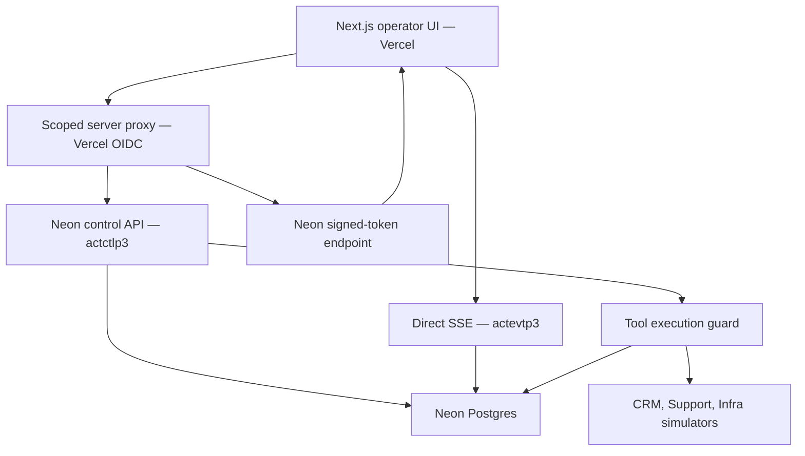

# Architecture snapshot

The control plane contains the registry, command bus, policy/risk evaluation, approvals, drift detection, usage tracking, and audit. Durable state and append-only evidence live in Neon Postgres.

Vercel forwards short-lived workload identity. Owner, project, environment, issuer, audience, expiry, and signature are verified in Neon. The internal handler key exists only inside the Neon control Function isolate. The event-signing secret is configured only on the Neon event Function; Vercel requests a signed 120-second token bound to the exact workspace/team.

The public proxy remains constrained to `ws_demo`, `team_operations`, `team_revenue`, the three demo agents, and `operator_demo`. Stream replay uses persisted per-workspace sequences and supports Last-Event-ID, after_sequence, reconnect, and heartbeat.

Migration 005 enforces the exact run/task/agent/team/workspace and approval/action/payload/risk binding through deferred composite foreign keys. Migration 006 adds a fence that locks and checks the authoritative agent and run until the mutation transaction commits. **006 is tested on isolated branch `br-square-dew-b57d7tcl` and has not been applied to main.** Phase 10 cannot freeze before that gate and fresh end-to-end acceptance pass.

Reasoning replay contains structured operational summaries and evidence references. Hidden chain-of-thought is neither stored nor exposed. All external business systems and metered agent outputs in this demo are simulated.
