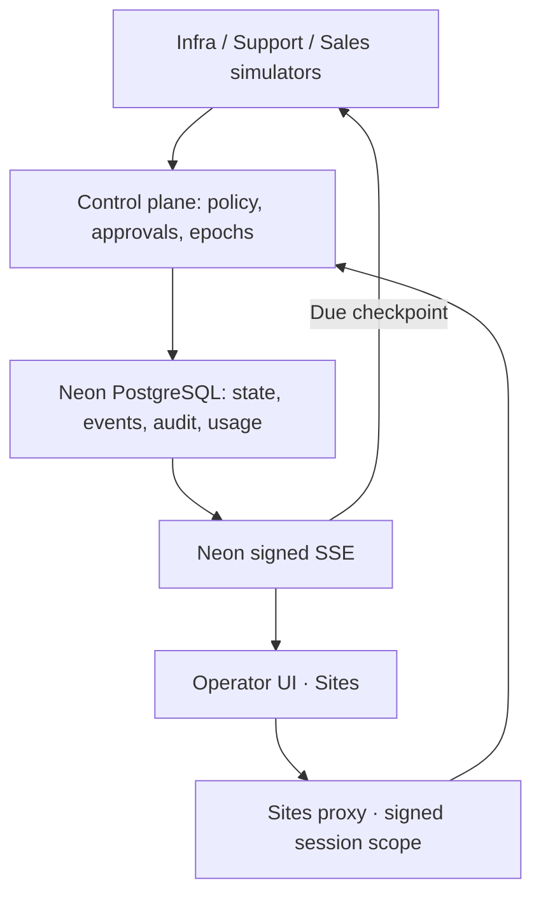

# Architecture snapshot

The control plane executes a single simulator step in its own transaction. The next step is due after five seconds. An open signed SSE connection drives due checkpoints on the server and sends committed events to the UI. Multiple viewer connections share the same authoritative PostgreSQL state and locks; they cannot duplicate a step. With no viewer, the demo remains at its last persisted checkpoint. Approval waits, pause and kill are persisted control states, not browser timer state.

Each public visitor has a separate workspace, two teams, one operator and three agents. A server-signed HttpOnly session cookie selects that scope. A new session creates new identities; refreshing reuses the current session. Existing terminal agents and append-only audit records are preserved.

Sites uses HTTP to Neon, with no PostgreSQL TCP sockets inside the hosted Worker. Its 30-second HMAC binds the Site, audience, workspace, method, path/query, body digest and idempotency header. Neon independently validates demo identity and agent/team scope. The browser receives a 120-second exact-scope SSE token and refreshes it before expiry, resuming from the last event sequence.

Migration 005 binds execution to the exact approved workspace/team/agent/run/task/tool/payload/risk tuple. Applied migration 006 checks and locks the authoritative agent first, then its run, through mutation commit. Starts, step execution, intervention and approval resolution follow that order. Pause prevents new steps; kill advances the epoch and is terminal. An atomic action already holding the lock can commit before a waiting kill, and all later stale actions are rejected.

Replay returns the last N structured reasoning summaries with evidence and usage. Usage totals reconcile with per-agent/per-task ledger entries. CSV and JSON audit exports support workspace and team scope. External business systems, reasoning and usage are simulated and labelled.
